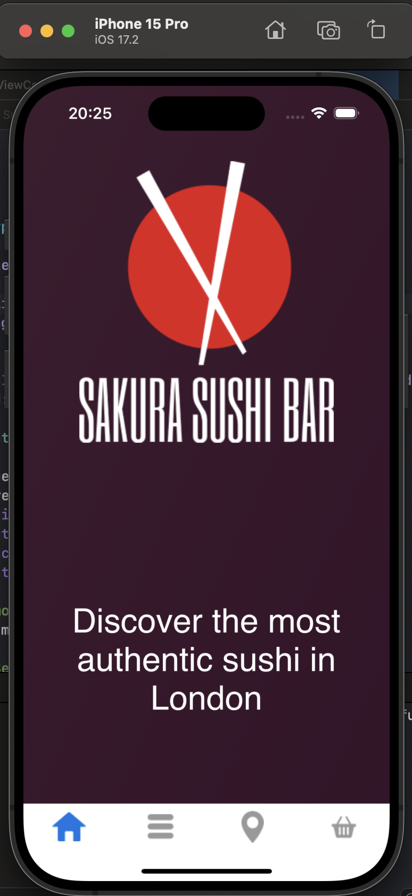
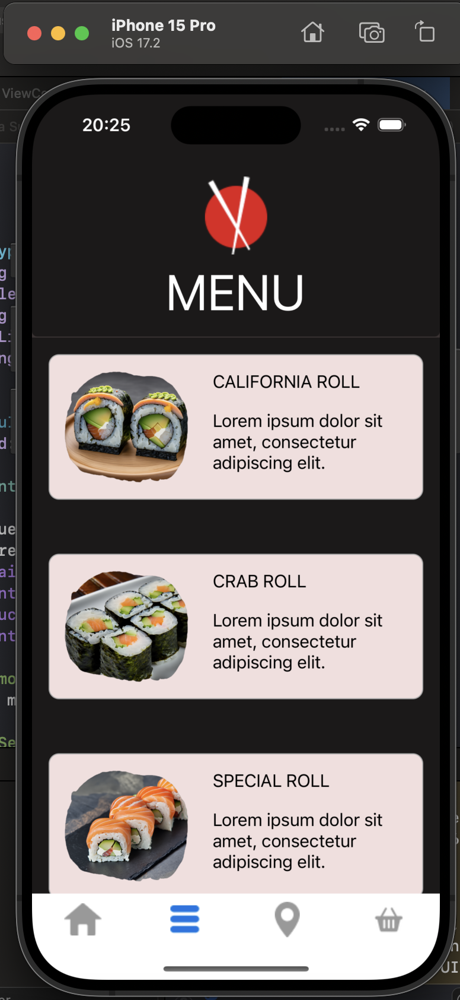
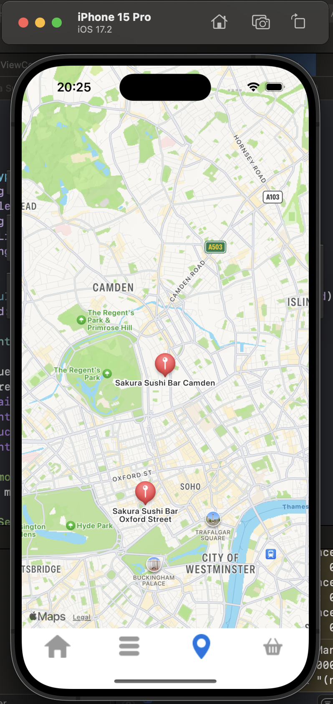
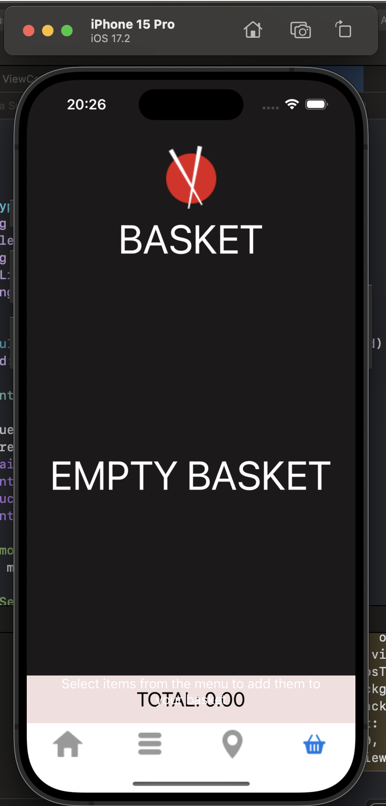
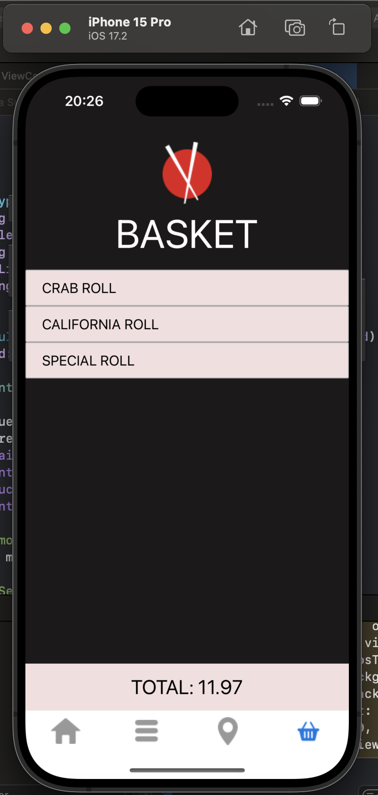

  Home Page: (Animated background which subtly changes colour)
 

 
Menu Page: (Cards are programatically generated based on results pulled from MongoDb collection)
 

 
Map Page: 
 

 
Empty Basket: (Updates base on what the user clicks from the menu.)
 

 
Basket containing items:
 

 
Example of the scroll animation on the menu:
 

 

To Do:

- Add remove from basket.
- Add mock checkout feature.
- Add "Add to basket" to menu cards for slicker ux
  

